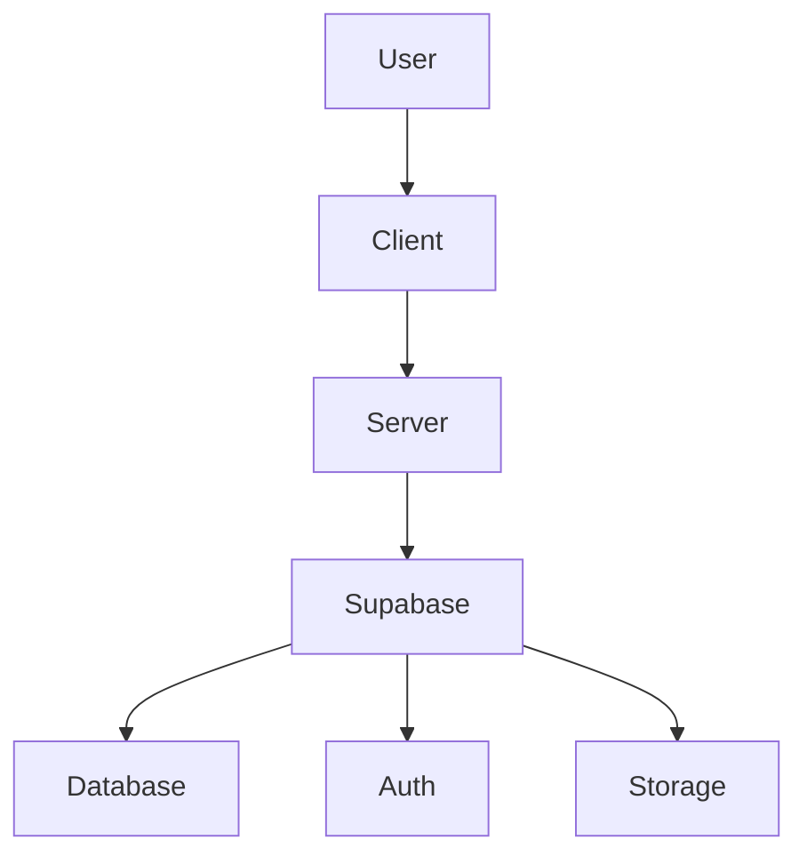

# Architecture Overview

This document outlines the system design and workflows for the Niyali Travel Site.

## High-Level Architecture

The application follows a client-server architecture with a Supabase backend.

- **Client:** Frontend application (React or Next.js) responsible for user interface and interaction.
- **Server:** Backend API (Express.js) handling business logic, data processing, and communication with Supabase.
- **Supabase:** Provides database, authentication, and storage services.

## Directory Structure

The project is organized into the following main directories:

- `/client`: Frontend application.
- `/server`: Backend application.
- `/supabase`: Supabase configuration and migrations.
- `/public`: Static files.
- `/docs`: Project documentation.

## Data Flow

1.  **User Interaction:** Users interact with the `Client` application.
2.  **API Requests:** The `Client` sends API requests to the `Server` for data retrieval, creation, updates, or deletion.
3.  **Business Logic:** The `Server` processes these requests, applies business logic, and interacts with `Supabase`.
4.  **Database Operations:** `Supabase` handles database operations (PostgreSQL), authentication, and file storage.
5.  **Response:** `Supabase` sends responses back to the `Server`, which then forwards them to the `Client`.
6.  **UI Update:** The `Client` updates its UI based on the received data.

## Key Technologies

- **Frontend:** React/Next.js, TypeScript, Tailwind CSS
- **Backend:** Node.js, Express.js, TypeScript
- **Database/Auth/Storage:** Supabase
- **Deployment:** VPS (Nginx)